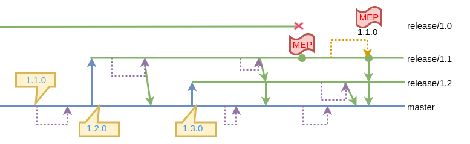
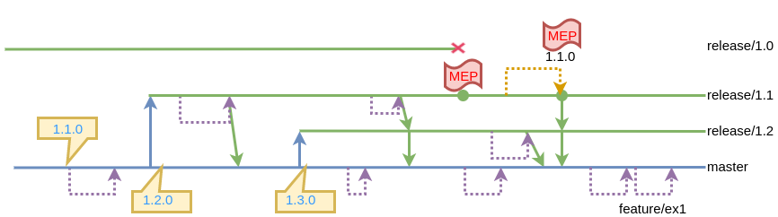

# État de départ (local)

```
*   ff978fc (HEAD -> master, origin/master) Merge branch 'release/1.2'
|\  
| * 40d27cd (origin/release/1.2, release/1.2) [1.2.0] add GUI.java
| * 5931851 (tag: 1.1.1, origin/release/1.1, release/1.1) [1.1.1] HOTFIX update CLI.java
* | 042b11b [1.3.0] update Web.java
* |   b537c24 merge 1.1 feature
|\ \  
| |/  
| * 074472b (tag: 1.1) [1.1.0] update CLI.java
* | 16ff4e1 [1.3.0] Add Web.java
|/  
* 9dcca0b [1.1.0] Add CLI.java
* 9f149c3 (tag: 1.0, origin/release/1.0, release/1.0) init repo
```




# TODO

## Faire une feature sur la version 1.3.0 (master)


* Créer une branche de 'feature' à partir de la branch 1.3 (master)
* Ajouter un fichier 'feature.java'
* Commit, merge et push les changements (il ne doit pas avoir de commit de merge!)


!!!! Attention votre repo local n'est pas forcément à jour  !!!!


# État d'arrivé (local)

```
775aec7 (HEAD -> master, origin/master, feat/ex1) [1.3.0] add ex1.java
* d95984d [1.3.0] update Web.java
*   ff978fc Merge branch 'release/1.2'
|\  
| * 40d27cd (origin/release/1.2, release/1.2) [1.2.0] add GUI.java
| * 5931851 (tag: 1.1.1, origin/release/1.1, release/1.1) [1.1.1] HOTFIX update CLI.java
* | 042b11b [1.3.0] update Web.java
* |   b537c24 merge 1.1 feature
|\ \  
| |/  
| * 074472b (tag: 1.1) [1.1.0] update CLI.java
* | 16ff4e1 [1.3.0] Add Web.java
|/  
* 9dcca0b [1.1.0] Add CLI.java
* 9f149c3 (tag: 1.0, origin/release/1.0, release/1.0) init repo
```




# Correction

#### création de la branche de feature
```
git checkout master
git checkout -b feat/ex1
```


#### dev de la feature
```
touch ex1.java
git add ex1.java
git commit -m "[1.3.0] add feature_ex1.java"
```


#### Récupération des derniers changements sur master
```
git checkout master
git pull --rebase origin master
```

#### On ajoute les changement de master dans notre branch de feature
```
git checkout feat/ex1
git rebase master
```

#### On intègre notre feature dans la branch  master

```
git checkout master
git merge feat/ex1
```

#### On push notre travail

```
git push origin master
```
