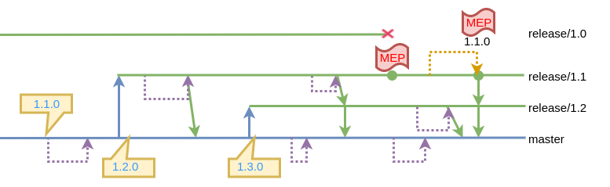

# État de départ (local)

```
*   ff978fc (HEAD -> master, origin/master) Merge branch 'release/1.2'
|\  
| * 40d27cd (origin/release/1.2, release/1.2) [1.2.0] add GUI.java
| * 5931851 (tag: 1.1.1, origin/release/1.1, release/1.1) [1.1.1] HOTFIX update CLI.java
* | 042b11b [1.3.0] update Web.java
* |   b537c24 merge 1.1 feature
|\ \  
| |/  
| * 074472b (tag: 1.1) [1.1.0] update CLI.java
* | 16ff4e1 [1.3.0] Add Web.java
|/  
* 9dcca0b [1.1.0] Add CLI.java
* 9f149c3 (tag: 1.0, origin/release/1.0, release/1.0) init repo
```




# TODO

## Faire une modification sur la branche master (1.3) dans le fichier 'Web.java' et resoudre les conflits de merge


* Créer une branche de 'feature' à partir de la master (1.3)
* Modifier un fichier 'Web.java'
* Commit, merge et push les changements


!!!! Attention votre repo local n'est pas forcément à jour  !!!!


# État d'arrivé (local)

```
* 94040b3 (HEAD -> master, origin/master) [1.3.0] update Web.java
* d95984d [1.3.0] update Web.java
| * 28946ca (updateWeb) [1.3.0] update Web.java
|/  
*   ff978fc Merge branch 'release/1.2'
|\  
| * 40d27cd (origin/release/1.2, release/1.2) [1.2.0] add GUI.java
| * 5931851 (tag: 1.1.1, origin/release/1.1, release/1.1) [1.1.1] HOTFIX update CLI.java
* | 042b11b [1.3.0] update Web.java
* |   b537c24 merge 1.1 feature
|\ \  
| |/  
| * 074472b (tag: 1.1) [1.1.0] update CLI.java
* | 16ff4e1 [1.3.0] Add Web.java
|/  
* 9dcca0b [1.1.0] Add CLI.java
* 9f149c3 (tag: 1.0, origin/release/1.0, release/1.0) init repo
```


# Correction

#### création de la branche de feature
```

git checkout master
git checkout -b updateWeb
```


#### dev de la feature
```
nano Web.java
git add --all
gcmsg "[1.3.0] update Web.java"
```


#### On ajoute les changement de la feature dans notre branch de master
```
git checkout master
git merge updateWeb
git pull --rebase origin master
```


#### Résolution du conflit

```
// modification du fichier
git add .
git rebase --continue
git push origin master
```
